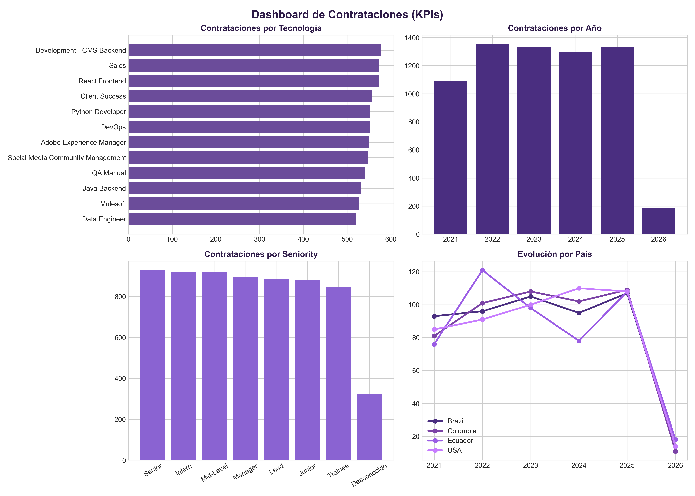

# Workshop 001: ETL Pipeline y Modelo Dimensional

Repositorio con el desarrollo del workshop.

## Estructura del Data Warehouse

El modelo dimensional consta de una tabla de hechos (`fact_applications`) y 5 dimensiones vinculadas:

* `fact_applications`: Métrica de contrataciones según criterio de negocio (`Code Challenge Score` >= 7 y `Technical Interview` >= 7).
* `dim_candidate`: Datos del candidato.
* `dim_technology`: Tecnologías evaluadas.
* `dim_seniority`: Niveles de experiencia.
* `dim_location`: Ubicación geográfica.
* `dim_date`: Dimensión de tiempo.

## Visualización de KPIs



## Ejecución

1. Clonar el proyecto e instalar dependencias:
   ```bash
   git clone [https://github.com/JulianaSerrano19/etl-workshop-data-engineer.git]
   cd etl-workshop-data-engineer
   pip install -r requirements.txt
